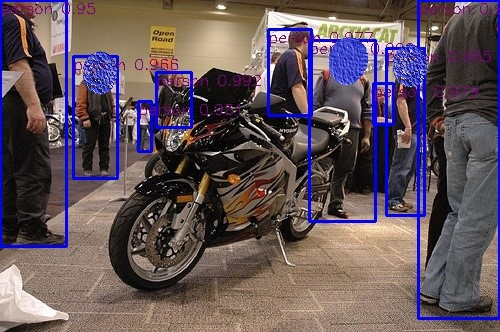
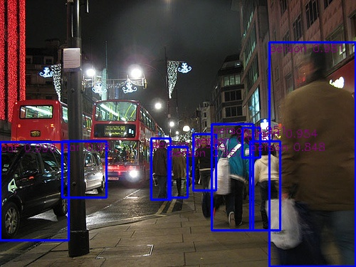
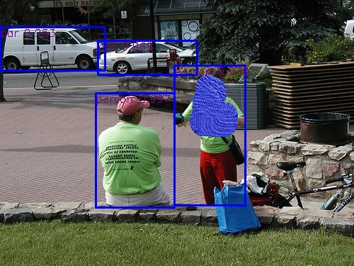
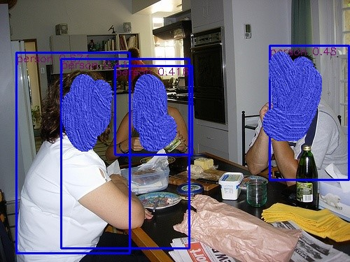
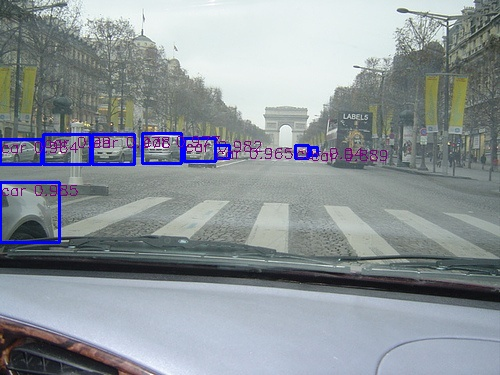
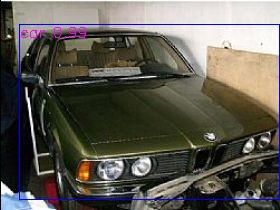
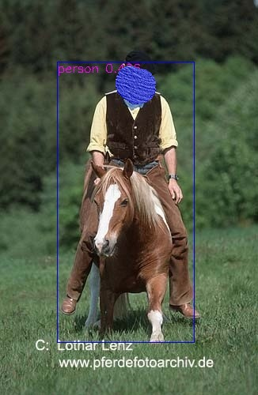

### Pytorch_YOLOV3 <br>
### --------------==================version 3 2022-09========------------------------------------ <br>
### download voc data 
[https://pjreddie.com/projects/pascal-voc-dataset-mirror/](https://pjreddie.com/projects/pascal-voc-dataset-mirror/)

then use `allcodes\\preprocess.py or allcodes\\preprocess_v.py` get data<br>
or you can download it from here [https://pan.baidu.com/s/1nzUiAwUWD8J_lV7qkTdq4w?pwd=u2dn](https://pan.baidu.com/s/1nzUiAwUWD8J_lV7qkTdq4w?pwd=u2dn)
### models
[https://pan.baidu.com/s/1lemOGC5zwJIcOcxWumCcRQ?pwd=9r22](https://pan.baidu.com/s/1lemOGC5zwJIcOcxWumCcRQ?pwd=9r22)
### use 3362 images with 2 classes person and car to train the model from scratch. the model is overfit, so the validation images is not so good.
```
#run
python allcodes/train_730.py
#predict
python allcodes/predict_730.py
```
#### train_overfit
 <br>
<br>
<br>
#### validation
 <br>
<br>
#### you can download yolov3 weight from here [https://pan.baidu.com/s/1hWIxV2MggrzL_vlnbMbP_w?pwd=sugw](https://pan.baidu.com/s/1hWIxV2MggrzL_vlnbMbP_w?pwd=sugw)
### --------------==================version 2 2022-09========------------------------------------ <br>
data is same as version 3
### models
[https://pan.baidu.com/s/16FPm_aOxI3hoJoQ0exAmVQ?pwd=xj5k](https://pan.baidu.com/s/16FPm_aOxI3hoJoQ0exAmVQ?pwd=xj5k)
#### train is not very good, maybe it is the yolohead coordinates problem
```
#run
python allcodes/train_717_730.py
#predict
python allcodes/predict_717_730.py
```
  
<br>
### --------------==================version 1 2021-08========------------------------------------ <br>
##### dataset used is voc2007, processed dataset can download from [processedvoc20072012](https://share.weiyun.com/NLjLT13V), unzip it to datas directory，[voc pretrained model](https://share.weiyun.com/7sTyVd7N)<br> 
```
#run
python models/train.py
#predict
python predict.py
```
<br>
  

## Reference
[https://github.com/Peterisfar/YOLOV3](https://github.com/Peterisfar/YOLOV3)<br>
[https://github.com/AlexeyAB/darknet](https://github.com/AlexeyAB/darknet)<br>
[https://github.com/qqwweee/keras-yolo3](https://github.com/qqwweee/keras-yolo3)<br>
[https://github.com/eriklindernoren/PyTorch-YOLOv3](https://github.com/eriklindernoren/PyTorch-YOLOv3)<br>
[https://github.com/YunYang1994/tensorflow-yolov3](https://github.com/YunYang1994/tensorflow-yolov3)<br>
[https://github.com/mystic123/tensorflow-yolo-v3](https://github.com/mystic123/tensorflow-yolo-v3)<br>
[https://github.com/Ray-Luo/YOLOV3-PyTorch](https://github.com/Ray-Luo/YOLOV3-PyTorch)<br>
[https://github.com/DeNA/PyTorch_YOLOv3](https://github.com/DeNA/PyTorch_YOLOv3)
