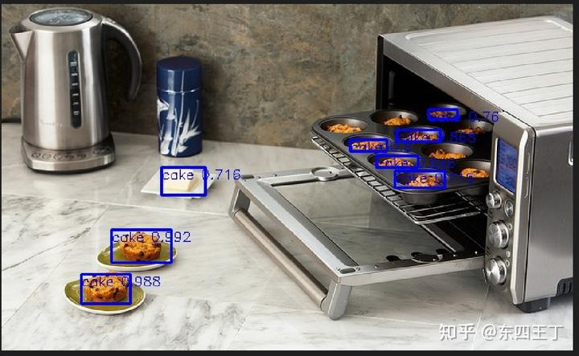
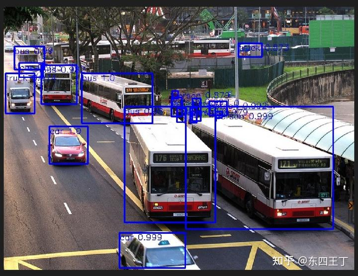
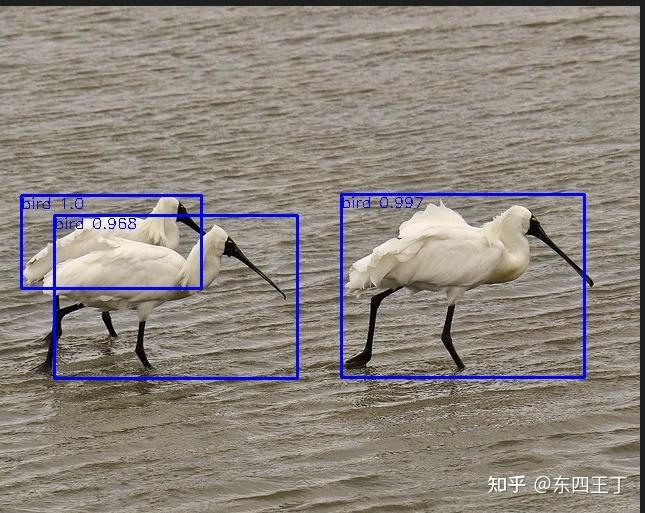

### Pytorch_YOLOV3  

##### dataset used is voc2007, processed dataset can download from [processedvoc20072012](https://share.weiyun.com/NLjLT13V), unzip it to datas directory，[voc pretrained model](https://share.weiyun.com/7sTyVd7N) 

  